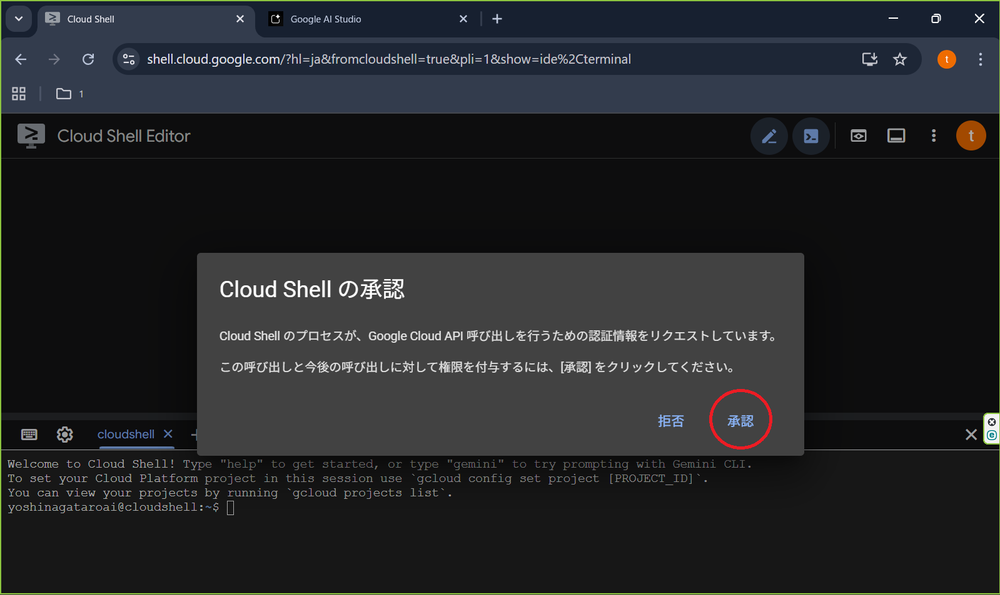
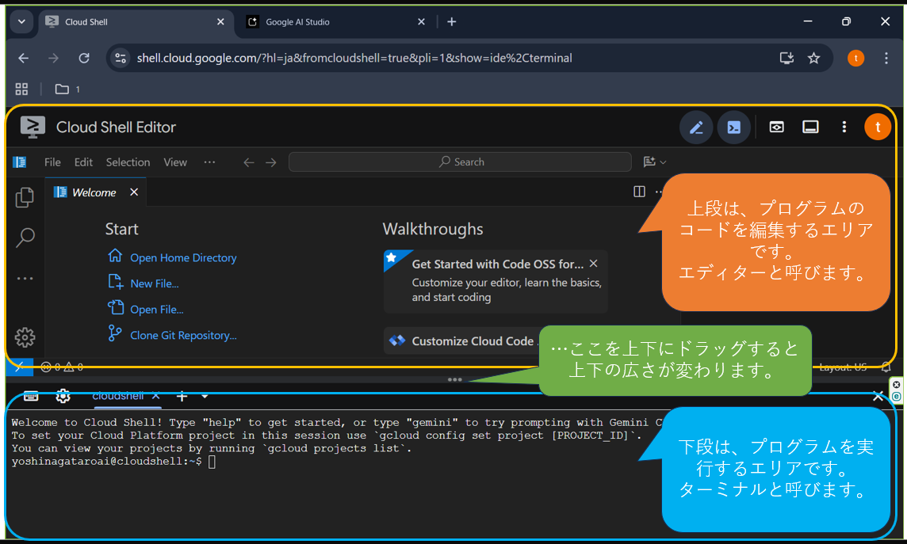
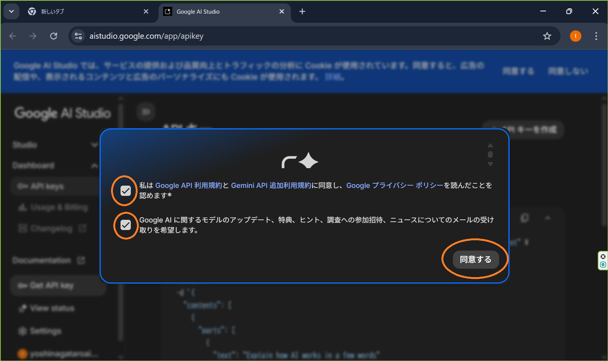
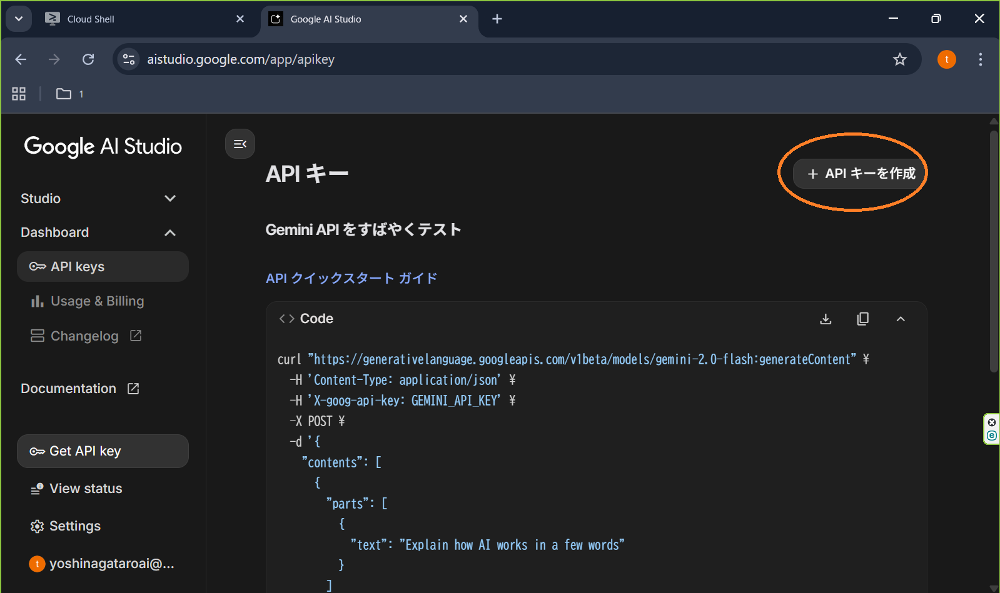
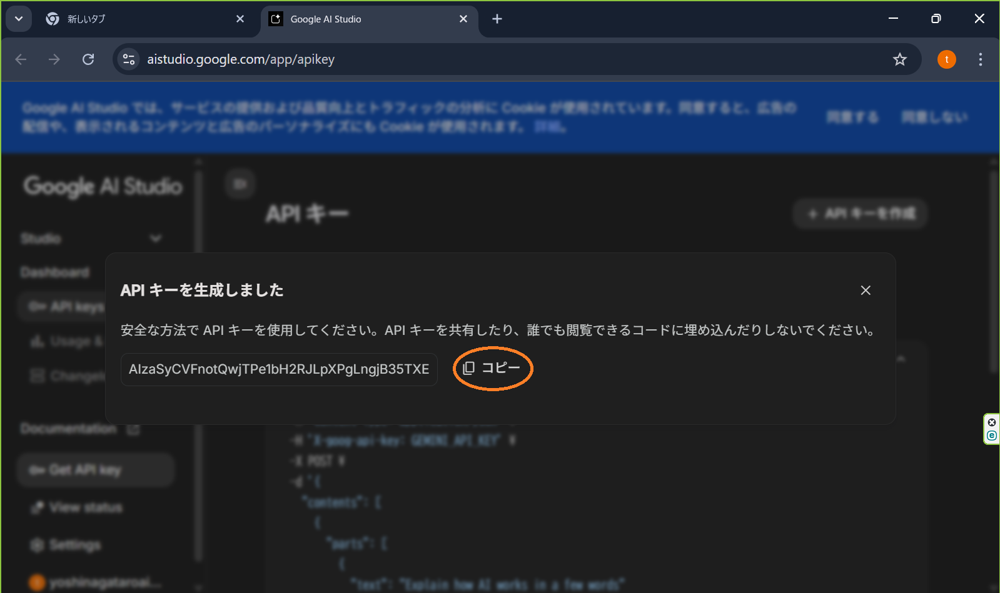

# はじめてのGoogle Drive自動化アプリ作成ガイド 🚀 

このガイドは、プログラミング経験が全くない方でも、自分専用のアプリを完成させられるように作られています。難しいことは全部「Cloud Shell」という魔法の箱がやってくれるので、安心してついてきてくださいね！

#### なぜ「Google Cloud Shell」を使うの？
一言でいうと、**「あなたのパソコンを汚さずに、無料でプロの開発環境が使えるから」**です。
料理に例えるなら、最新の調理器具がすべて揃った、ピカピカのレンタルキッチンを無料で使えるようなものです。後片付けも不要で、とっても便利！

*   **目次:**
- [ステップ1](#ステップ1主催者にgmailアドレスを連絡しよう！所要時間約1分)
- ステップ1： 主催者にgmailアドレスを連絡しよう！（所要時間：約1分）
- ステップ2： Google cloud shell にアクセスしよう！ (所要時間: 約3分)
- ステップ3： 魔法の箱に「アプリの素」をセットしよう！ (所要時間: 約3分)
- ステップ4： アプリとあなたのアカウントを「握手」させよう！ (所要時間: 約3分)
- ステップ5： バイブコーディング前の確認作業をしよう！ (所要時間: 約1分)
- ステップ6： バイブコーディングの準備をしよう！ (所要時間: 約3分)
- ステップ7： gemini-cliを使って、バイブコーディングしよう！ (所要時間: 約3分)
- ステップ8： gemini-cliを終了して、アプリを実行します。 (所要時間: 約3分)

---

### ステップ1:主催者にgmailアドレスを連絡しよう！（所要時間：約1分）
事前のアンケートで、gmailアドレスを連絡してくださいと依頼がありますので、
gmailアドレスを連絡してください。
日ごろ利用しているものでも良いですし、不安を感じる場合は、新たに作っても良いでしょう。
連絡することで、以下の`ステップ4`の作業ができるようになります。 

---

### ステップ2：Google cloud shell にアクセスしよう！ (所要時間: 約3分)
*   **作業内容:**
    1. ステップ1で主催者に連絡した、gmailアドレスでログインしているブラウザで行います。
    2. 下記URLをあなたのブラウザで開いてください。
    ```bash
    https://shell.cloud.google.com/?hl=ja&fromcloudshell=true&show=ide%2Cterminal
    ```
    3. クラウドシェルの認証が表示されたら、右下の認証をクリックします
    

    4. この画面がクラウドシェルです
    

---

### ステップ3：魔法の箱に「アプリの素」をセットしよう！ (所要時間: 約3分)


*   **作業内容:**
    1. まずは、私があらかじめ用意した **「アプリの素」** が詰まったzipファイルを、あなたのCloud Shellにアップロードしましょう。
    このzipファイルには、アプリの設計図や、Googleに挨拶するための **「身分証明書 (`credentials.json`)」** など、必要なものが全て入っています。
    2. 以下のリンクから`py_movie_donwloader_template.zip`というファイルを、あなたのパソコンにダウンロードします。
    [py_movie_donwloader_template.zip ダウンロード](https://github.com/sinzy0925/py_movie_downloader_template/raw/refs/heads/main/img/py_movie_downloader_template.zip)

    3.  次に、Cloud Shellを開き、画面右上の**さらに表示メニュー（︙）** から「**アップロード**」を選択して、今ダウンロードした`py_movie_donwloader_template.zip`をアップロードします。

    4.  最後に、以下のコマンドを実行して、zipファイルを解凍（展開）し、準備を完了させます。
        ```bash
        unzip py_movie_donwloader_template.zip && cd py_movie_donwloader_template
        ```

> **ポイント：**
> この`unzip`というコマンドは、「魔法の箱を開けて、中身を取り出して！」というおまじないのようなものです。これを実行するだけで、アプリ作りの準備が全部整います。

---

### ステップ4：アプリとあなたのアカウントを「握手」させよう！ (所要時間: 約3分)

次に、このアプリに対して、あなた自身が「私のGoogle DriveにアクセスしてOKですよ」という**許可**を与える必要があります。
この「握手」の儀式を行うのが、`a00_start.py`というスクリプトの役目です。

*   **作業内容:**
    1.  まず、アプリに必要な部品（ライブラリ）をインストールします。以下のコマンドを実行してください。
    ```bash
    pip install -r requirements.txt
    ```
    2.  次に、以下のコマンドで「握手」を開始します。
    ```bash
    python a00_start.py
    ```
    3.  画面に長いURLが表示されるので、それをコピーしてブラウザで開きます。
    4.  見慣れたGoogleのログイン画面が表示されるので、ログインして「**許可**」をクリックします。
    5.  ブラウザに「認証コード」が表示されたら、それをコピーして、Cloud Shellの画面に貼り付けてEnterキーを押します。

*   **何が起きるの？**
    この「握手」が成功すると、その証として **`token.json`** という特別な **「合鍵」** が自動的に作られます。
    これ以降、アプリはこの「合鍵」を使って、あなたのGoogle Driveに安全にアクセスできるようになります。

    `「★★★ 認証が正常に完了しました！ ★★★」`と表示されたら、このステップは成功です！

---

### ステップ5：バイブコーディング前の確認作業をしよう！ (所要時間: 約1分)
*   **作業内容:**
    1. 以下のコマンドを入力して、エンターキーを押してください。
    ```bash
    python m01_google_drive_manager.py
    ```
    2. エラーがでたら、ＯＫです。

---

### ステップ6：バイブコーディングの準備をしよう！ (所要時間: 約3分)
*   **作業内容:**

    1. 今回は非常に簡単な例でバイブコーディングします。
    2. まず、自分のgoogleドライブをブラウザで開き、フォルダを作成します。
    3. フォルダの共有設定をして、だれからでもアクセスできるようにします。
    4. フォルダのURLのfolders/以降の文字列をコピーします
    　　https://drive.google.com/drive/folders/1h9NQgOxpxk　なら、1h9NQgOxpxk をコピーします。
    5. このフォルダに、拡張子がmp4の動画ファイルを入れておきましょう。あとで、この動画ファイルを文字起こしします。　入れる動画ファイルが無ければ、サンプルとして以下の動画ファイルをダウンロードして入れてください。

---

### ステップ7：gemini-cliを使って、バイブコーディングしよう！ (所要時間: 約3分)
*   **作業内容:**
    1.  以下のコマンドでgemini を起動します
    ```bash
    gemini
    ```
    2. 初めての人は、ログインを求められますので、いつも使うのと同じgoogleアカウントでログインしてください。
    3. 以下の命令をgeminiに貼り付け、エンターキーを押します。
    　　@m01_google_drive_manager.py の'SHARED_DRIVE_FOLDER_ID'の値を'1h9NQgOxpxk'に変更してください。
    4. geminiから、修正しても良いですかと英語で聞かれますので、エンターキーを押してください。

---

### ステップ8：gemini-cliを終了して、アプリを実行します。 (所要時間: 約3分)
*   **作業内容:**
    1. gemini-cliを終了しますので、「Ctrl + c」を数回入力してください。
    2. 以下のコマンドを入力して、アプリを実行します。
    ```bash
    python m01_google_drive_manager.py
    ```
>    ヒント: 
>    gemini-cliを終了せずに、gemini-cliに実行させる方法もあります。処理が遅いので上記では自分でアプリを実行しています。gemini-cliに実行してもらう命令方法はこれです。
「m01_google_drive_manager.pyを実行して」

---

### ステップ9以降：[オプション作業]全てのアプリを自動実行して、動画ファイルから文字起こししてマガジンを作ります。


### ステップ9：[オプション作業]gemini-apiを活用して、音声ファイルを文字起こしするために、geminiのAPIキーを取得します。
*   **作業内容:**
    全てのアプリを実行するには、更にいくつか作業が必要です。
    1. Google ai studio で、geminiのAPIキーを取得します。
    ```bash
    https://aistudio.google.com/app/apikey
    ```
    2. 同意画面が表示される方は、同意してください。
    

    3. 画面右上の、「＋ APIキーを作成」をクリックしてください。
    

    4. APIキーが生成されたので、中央のコピーボタンをクリックしてください。
    


---

### ステップ10：[オプション作業]Google cloud shellにもどり、エディター画面を操作します。
*   **作業内容:**
    1. 


